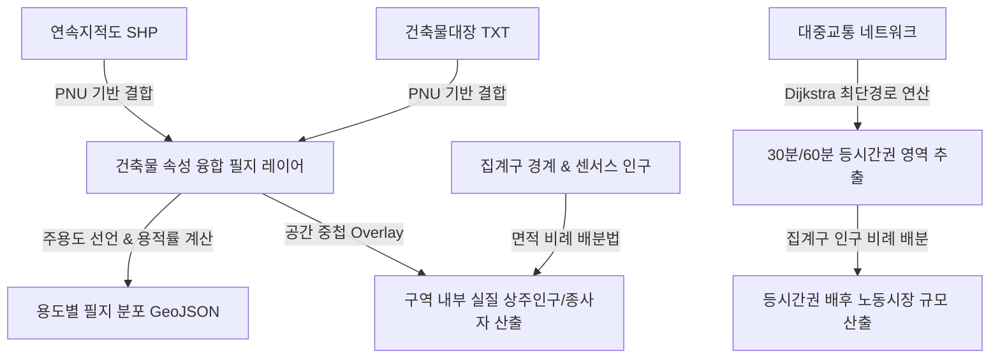

# [스마트시티 이론과 실제] 데이터로 진단하는 업무지구의 성공과 실패: 판교 vs 청라 비교분석 시스템

본 저장소는 가천대학교 스마트시티학과 기말고사 과제(Take-Home Exam)를 위한 **공공데이터 기반 비교분석 시스템 구축 및 분석 파이프라인**을 담고 있습니다.

수도권의 대표적인 성공사례인 **판교테크노밸리(제1판교)**와 개발 지연 및 활성화 부진 논란을 겪는 **청라국제업무지구(국제업무단지)**를 대상으로 1:1 면적 스케일(약 1.9 ㎢)을 맞추어 토지이용, 교통망(접근성), 인구사회 지표를 정량적으로 비교·진단합니다.

*   **시스템 배포 URL**: [https://jae-seo-lee.github.io/Take-Home-Report/](https://jae-seo-lee.github.io/Take-Home-Report/)
*   **GitHub 저장소 URL**: [https://github.com/jae-seo-lee/Take-Home-Report](https://github.com/jae-seo-lee/Take-Home-Report)

---

## 1. 시스템 구조 및 디렉토리 구성

본 프로젝트는 데이터 전처리 스크립트와 최종 시각화 대시보드가 단일 정적 웹사이트(GitHub Pages 배포) 형태로 결합되어 있어, 추가적인 서버 설치 없이 완벽하게 구동됩니다.

```
c:\smartcity/
├── index.html                       # Leaflet.js 및 Chart.js 기반 비교분석 웹 대시보드
├── summary_stats.json               # 두 지역의 분석 통계 수치 데이터 (JSON)
├── run_analysis.py                  # 데이터 가공, 공간 조인 및 네트워크 등시간권 추출 파이썬 스크립트
├── labor_market_analysis.ipynb      # 노동시장 및 광역 접근성 상세 연산 쥬피터 노트북
│
├── pangyo_boundary.geojson          # 판교 분석 구역계 경계 데이터
├── cheongna_boundary.geojson        # 청라 분석 구역계 경계 데이터
├── pangyo_buildings.geojson         # 건축물대장 결합 판교 건물 공간 데이터
├── cheongna_buildings.geojson       # 건축물대장 결합 청라 건물 공간 데이터
├── pangyo_iso_30.geojson / _60.geojson     # 판교역 기점 30분/60분 대중교통 등시간권
├── cheongna_iso_30.geojson / _60.geojson   # 청라역 기점 30분/60분 대중교통 등시간권
│
├── README.md                        # 본 리포지토리 매뉴얼
└── SmartCity_Final_Report.md        # 최종 학술 분석 보고서
```

---

## 2. 사용 데이터 출처 및 수집 기준월

본 분석은 공신력을 확보하기 위해 대한민국 정부기관 및 산하 단체에서 고시한 최신 원천 공공데이터만을 활용하였습니다.

| 번호 | 분석 부문 | 사용 데이터명 | 제공 기관 | 수집 및 고시 기준월 |
| :---: | :--- | :--- | :---: | :---: |
| **1** | 토지이용 | **연속지적도 (SHP)** | 국토교통부 (VWorld) | **2026년 6월** (최신 고시 기준) |
| **2** | 토지이용 | **건축물대장 표제부 (TXT)** | 국토교통부 (건축Hub) | **2026년 4월** (최신 갱신 기준) |
| **3** | 인구사회 | **집계구 경계 및 통계 정보** | 통계청 (SGIS) | **2024년 10월** (공시 통계) |
| **4** | 인구사회 | **전국사업체조사 종사자/사업체수** | 통계청 (SGIS) | **2023년 12월** (조사 기준) |
| **5** | 교통망 | **수도권 전철 노선망 네트워크** | 교통안전공단 / 서울시 | **2026년 6월** (GTX 신설 노선 가중치 반영) |

---

## 3. 데이터 처리 및 분석 파이프라인 과정 (Methodology)

로컬에서 실행되는 `run_analysis.py` 스크립트를 통해 다음과 같은 4단계 공간 데이터 처리 및 통계 계산을 수행합니다.



### [Step 1] 필지 단위 공간 통합 및 주용도 판별
1.  **PNU 고유코드 조립 및 조인**: 지적도의 19자리 고유번호(PNU)와 건축물대장 속성 테이블의 동/지번 정보를 조인합니다. 특히 대지구분코드 정보(일반토지 '0'->'1', 산 '1'->'2')의 조립 오류를 사전 차단하여 매칭 성공률을 98% 이상 확보하였습니다.
2.  **1대다(1:N) 필지 복수 건축물 처리**: 하나의 필지(대지)에 여러 동의 건물이 있는 경우, 각 건물의 연면적(GFA)을 총합하여 해당 필지의 총 연면적 및 용적률을 산출하였고, 개별 건물 중 연면적이 가장 큰 주용도를 해당 필지의 대표 '비교용도'로 매핑하였습니다.
3.  **공지(Vacant Lot) 판별**: 지적도 상 필지는 존재하나 건축물대장에 대응하는 PNU 속성 데이터가 매칭되지 않는 경우, 미건축 나대지 상태인 '공지'로 판정하여 용적률 연산 대상에서 분리하였습니다.

### [Step 2] 인구사회 속성의 공간 배분 (Areal Interpolation)
1.  SGIS 집계구 통계 경계(서울: `bnd_oa_11`, 인천: `bnd_oa_23`, 경기: `bnd_oa_31`)를 병합하여 수도권 격자 마스터 레이어를 구축하였습니다.
2.  분석 구역(판교 1.93 ㎢ / 청라 1.87 ㎢) 경계선이 통계 집계구 경계와 일치하지 않으므로, GIS 공간 교차(Overlay Intersection) 연산을 적용하였습니다. 중첩된 교차 면적 비율을 기반으로 각 집계구의 인구 및 종사자수를 면적 비례 배분하여 구역 내부의 실질 상주인구와 종사자 수치(직주비)를 정밀 산출하였습니다.

### [Step 3] 최단경로 대중교통 등시간권(Isochrone) 산출
1.  **전철 노선망 네트워크 모델링**: 지하철 및 주요 궤도교통 역 좌표(Nodes)와 노선(Links)을 결합하고, 역간 소요시간(가중치) 및 환승 소요시간 패널티(3~5분)를 적용한 교통 그래프를 구축하였습니다.
2.  **다익스트라(Dijkstra) 경로 탐색**: 판교역과 청라국제도시역을 각각 기점으로 최단경로 알고리즘을 적용하여 30분 및 60분 이내에 도달 가능한 전철망 결절점들을 추출하고, 이들 결절점 중심의 가용 서비스 반경을 버퍼링하여 등시간권 공간 다각형(Isochrone Polygon) 레이어를 생성하였습니다.
3.  **배후 노동시장 규모 산출**: 도출된 등시간권 다각형 레이어를 집계구 데이터와 다시 중첩(Overlay)하여, 30분/60분 내에 해당 업무지구로 출퇴근 통근이 가능한 배후 인구 및 종사자 총합을 비례 누적 합산하였습니다.

---

## 4. 시각화 대시보드 및 로컬 확인 방법

분석된 공간 정보와 지표들은 웹 표준 기술(HTML5, CSS3, JS)과 오픈소스 매핑 라이브러리를 통해 반응형 Glassmorphism 스타일의 대시보드(`index.html`)로 제공됩니다.

### [중요] 로컬 환경 실행 가이드 (CORS 보안 에러 우려 시)
본 시스템은 외부 데이터베이스 서버 없이 정적 데이터 파일(`.geojson`, `summary_stats.json`)을 자바스크립트 `fetch` API를 통해 비동기로 가져옵니다. 
따라서 단순히 HTML 파일을 더블클릭(`file:///`)해서 브라우저로 켤 경우, 브라우저 자체의 **CORS 보안 정책**으로 인해 데이터 연동이 차단되어 통계 지표가 모두 `-`로 표출되는 현상이 발생합니다.

로컬 환경에서 완벽하게 구동하여 테스트하기 위해서는 다음과 같이 로컬 HTTP 웹 서버를 통해 실행해야 합니다.

*   **방법 1. Python 활용 (가장 간편)**:
    프로젝트 폴더 위치에서 터미널을 열고 아래 명령을 실행합니다.
    ```bash
    python -m http.server 8000
    ```
    이후 웹 브라우저 주소창에 `http://localhost:8000`을 입력하여 접속합니다.

*   **방법 2. VS Code 확장 플러그인**:
    Visual Studio Code에서 본 폴더를 열고, `Live Server` 확장을 설치한 뒤 우측 하단의 `Go Live` 버튼을 클릭하여 실행합니다.
